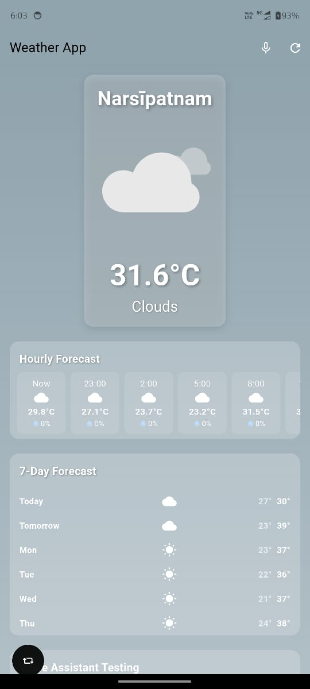

# Flutter Weather App

A feature-rich, elegant weather application built with Flutter that provides comprehensive weather information with an intuitive interface. Powered by the OpenWeatherMap API, the app combines beautiful animations with practical features to deliver an exceptional user experience.


## ✨ Features

### UI/UX Enhancements
- **Animated Weather Icons** - Dynamic Lottie animations that change based on weather conditions (rain, snow, clear, etc.)
- **Dark Mode** - Seamless toggle between light and dark themes to suit your preference
- **Live Wallpapers** - Background dynamically adapts to current weather conditions and time of day

### Functional Enhancements
- **Real-time Weather Data** - Accurate weather information based on your current location
- **Hourly Forecast** - Detailed weather predictions for the next 24 hours
- **Weekly Forecast** - Extended 7-day weather outlook with temperature ranges
- **Weather Alerts** - Notifications for extreme weather conditions in your area
- **Offline Mode** - Access to your last fetched weather data when no internet connection is available

### Advanced Features
- **Voice Assistant** - Natural language interface to query weather information using voice commands
- **Responsive Design** - Optimized layout that works across all device sizes

## 🚀 Getting Started

### Prerequisites
- Flutter SDK (version 3.0.0 or higher)
- Dart SDK (version 2.17.0 or higher)
- Android Studio / VS Code
- An OpenWeatherMap API key

### Installation

1. Clone this repository
```bash
git clone https://github.com/yourname/weather-app.git
```

2. Navigate to the project directory
```bash
cd weather-app
```

3. Install dependencies
```bash
flutter pub get
```

4. Update the API key in `lib/services/weather_services.dart` with your OpenWeatherMap API key
```dart
final weatherServices = WeatherServices('YOUR_API_KEY_HERE');
```

5. Run the app
```bash
flutter run
```

## 📦 Dependencies

- [provider](https://pub.dev/packages/provider) - For state management
- [http](https://pub.dev/packages/http) - For making API calls
- [geolocator](https://pub.dev/packages/geolocator) - For getting device location
- [geocoding](https://pub.dev/packages/geocoding) - For converting coordinates to address
- [lottie](https://pub.dev/packages/lottie) - For loading and displaying animations
- [shared_preferences](https://pub.dev/packages/shared_preferences) - For local data persistence
- [speech_to_text](https://pub.dev/packages/speech_to_text) - For voice recognition
- [flutter_tts](https://pub.dev/packages/flutter_tts) - For text-to-speech functionality
- [url_launcher](https://pub.dev/packages/url_launcher) - For launching URLs
- [intl](https://pub.dev/packages/intl) - For date and number formatting

## 📂 Project Structure

```
lib/
├── main.dart                    # Application entry point
├── models/
│   └── weather_models.dart      # Data models for weather information
├── pages/
│   └── weather_page.dart        # Main weather display page
├── providers/
│   └── theme_provider.dart      # Theme state management
├── services/
│   ├── weather_services.dart    # API and location services
│   └── voice_assistant.dart     # Voice recognition and command processing
└── widgets/
    ├── footer_widget.dart       # Footer with contact information
    ├── hourly_forecast.dart     # Horizontally scrollable hourly forecast
    ├── weekly_forecast.dart     # 7-day weather prediction display
    └── weather_alert_widget.dart # Weather warnings and alerts
```

## 🔧 How It Works

1. When the app starts, it requests permission to access the device's location
2. Once permission is granted, it gets the current coordinates
3. The coordinates are sent to the OpenWeatherMap API to fetch current weather and forecast data
4. Weather data is parsed and displayed with appropriate animations
5. The UI updates to show current conditions, hourly forecast, and weekly outlook
6. Weather alerts are displayed if any are present
7. Voice assistant is ready to process weather-related commands

## 🎤 Using the Voice Assistant

The voice assistant can respond to commands like:
- "What's the weather today?"
- "What's the temperature right now?"
- "Show me the forecast for tomorrow"
- "Is there any weather alert?"
- "Switch to dark mode"

## 🎨 Customizing Animations

The app uses Lottie animations to represent different weather conditions. To add or modify animations:

1. Place your .json animation files in the `assets/animations/` directory
2. Update the `getWeatherAnimation` method in `weather_page.dart` to use your new animations
```dart
String getWeatherAnimation(String mainCondition) {
  switch (mainCondition.toLowerCase()) {
    case 'clear':
      return 'assets/animations/sunny.json';
    case 'clouds':
      return 'assets/animations/cloudy.json';
    // Add your custom animations here
    default:
      return 'assets/animations/default.json';
  }
}
```

## 📱 Screenshot

<div style="display: flex; flex-wrap: wrap; gap: 10px;">
  
</div>

## 🌐 API Reference

This app uses the [OpenWeatherMap API](https://openweathermap.org/api) to fetch weather data. You'll need to sign up for a free API key to use this application.


## 🙏 Acknowledgements

- [OpenWeatherMap](https://openweathermap.org/) for providing the weather data API
- [Lottie](https://airbnb.design/lottie/) for the beautiful animations
- [Flutter](https://flutter.dev/) for the amazing cross-platform framework
